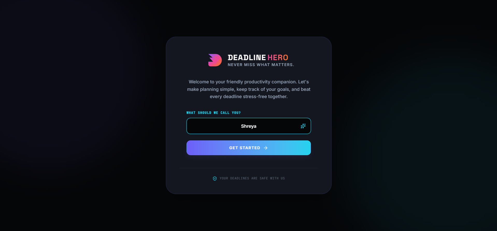
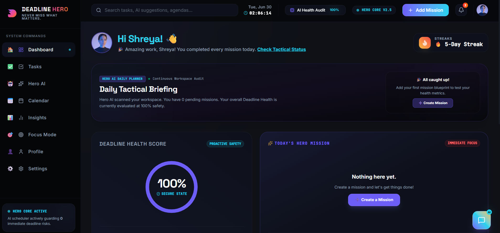
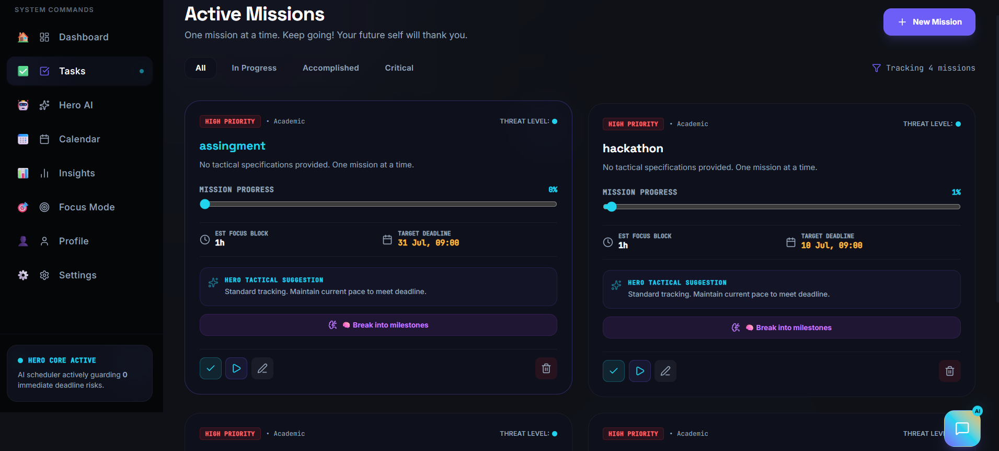
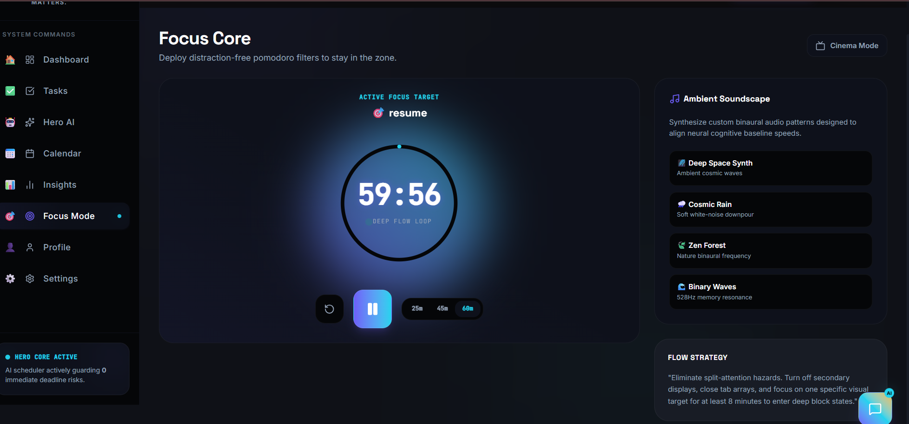
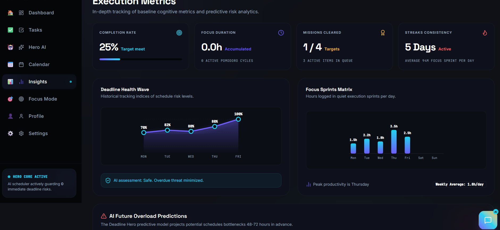
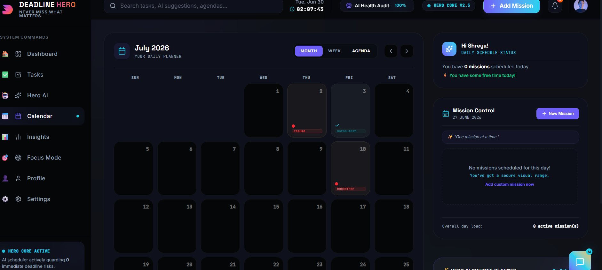
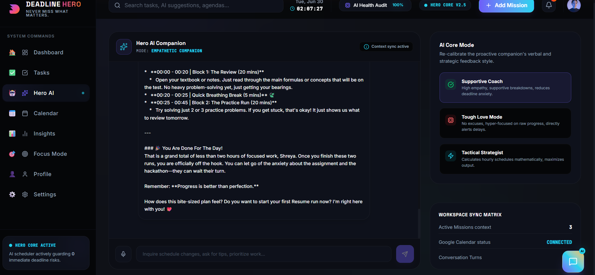
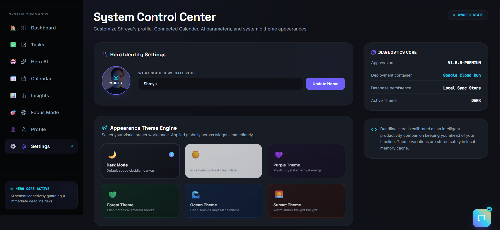

# 🚀 Deadline Hero

> **AI-powered productivity companion that helps users plan, prioritize, and complete tasks before deadlines are missed.**

## 📌 Problem Statement

**The Last-Minute Life Saver**

Students, professionals, and entrepreneurs often miss important deadlines because traditional reminder apps only notify users without helping them take action.

**Deadline Hero** solves this problem by acting as an intelligent AI productivity companion that helps users organize their work, prioritize tasks, and create actionable daily plans.

---

## ✨ Features

* 🤖 AI-powered task prioritization
* 📅 Smart daily schedule generation
* ⏰ Context-aware deadline reminders
* 🎯 Personalized productivity recommendations
* 📊 Task progress tracking
* 💡 AI-generated suggestions to improve focus and productivity

---

## 🛠️ Tech Stack

* Google AI Studio
* Gemini API
* TypeScript
* HTML
* Vite

---

## 🎯 How It Works

1. User adds tasks and deadlines.
2. AI analyzes urgency and importance.
3. Tasks are automatically prioritized.
4. A personalized daily schedule is generated.
5. AI provides productivity suggestions to help users stay on track and avoid missing deadlines.

---

## 💡 Why Deadline Hero?

Unlike traditional reminder applications, Deadline Hero goes beyond notifications by helping users make better decisions, manage their workload effectively, and take meaningful action before deadlines are missed.

---

## 📷 Screenshots

## 📷 Application Screenshots

### 🏠 Home

### 📊 Dashboard

### ✅ Task Management

### 🎯 Focus Mode

### 📈 Insights

### 📅 Calendar

### 🤖 Hero AI Assistant

### ⚙️ Settings

---

## 🚀 Deployment

https://deadline-hero-companion-663428749973.asia-southeast1.run.app

---

## 👩‍💻 Developed By

**Shreya Somkuwar**

Built for the **Vibe2Ship Hackathon 2026** using **Google AI Studio**.

